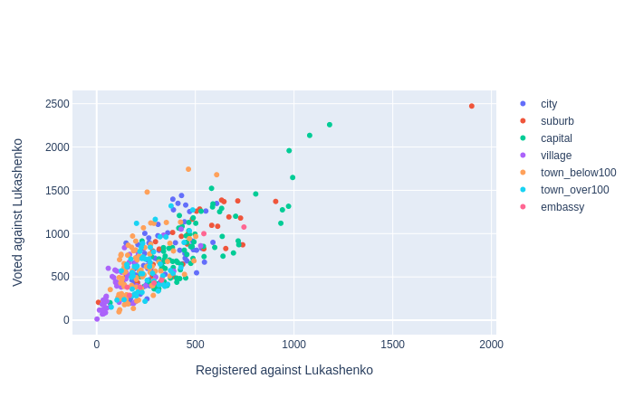
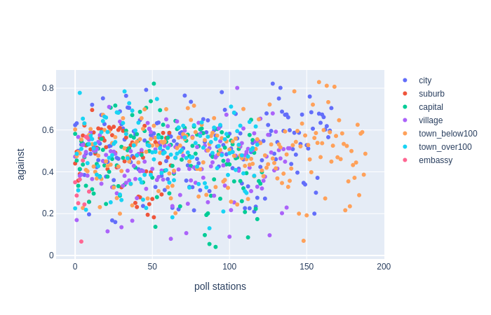
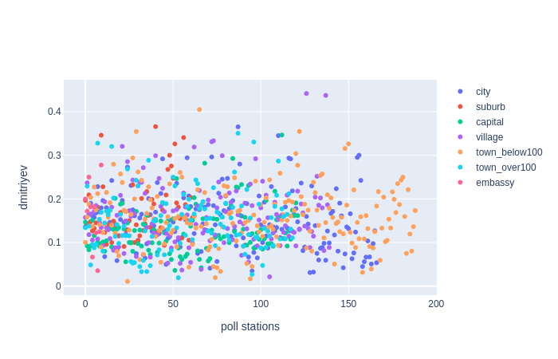
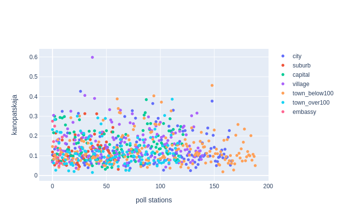
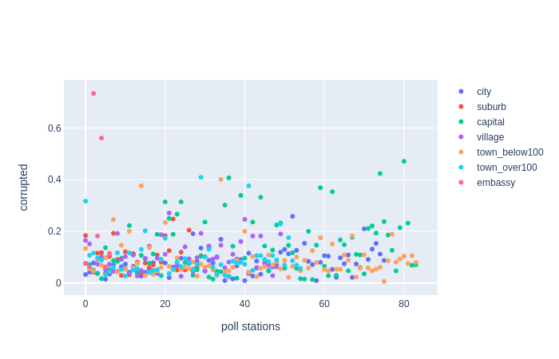

# Analyzing Voice2020 data.


Reference:
1. Source dara
 * 1.1. voice.csv
 * 1.2. geo-categorized.csv
 * 1.3. zubr.csv
2. Data preparation.
 * 2.1 Registered count vs Photos count
 * 2.2 Fix number of corrupted ballots
3. Calculate coefficients
 * 3.1 Tsikhanouskaya coefficients
 * 3.2 Protest coefficients
 * 3.3 Alternative candidates coefficients
4. Clear data based on Zubr reports
5. Turnout estimation
6. Caclulate total 
 * 6.1 Number of votes
 * 6.2 Votes per candidates
7. Results


## 1. Source data

There are 3 sourcs datasets to analyze


### geo-categorized.csv

Columns: 
* `id` - poll station unique identifier.
* `latitude`, `longitude` - poll station coordinates.
* `town` - town/city/village where poll station is situated.
* `area` - one of the following:
 * `village`
 * `town_below100` (towns with population less than 100.000 people)
 * `town_over100` (one of 9 towns with population over 100.000)
 * `city` (one of 5 region centers)
 * `capital` (Minsk)
 * `embassy` (poll stations abroad)
 * `minsk_suburb` (20 km around Minsk)
* `region`
 * 1 - Brest region
 * 2 - Viciebsk region
 * 3 - Homel region
 * 4 - Hrodna region
 * 5 - Minsk region
 * 6 - Mahiliou region
 * 7 - Minsk
 * 8 - Embassy
 
#### How was it built?
<details>TBD</details>

### voice.csv

Data from the Voice patform. Rows have the following key fields:
* `id` - poll station unique identifier
* `tihanovkaja_registered` - number of users who was going to vote for **tihanovkaja**
* `tihanovkaja_photoVoices` - number of ballots for **tihanovkaja** approved by photo
* `tihanovkaja_officialVotes` - number of ballots for **tihanovkaja** according to an official report
* and 18 more similar columns prefixed by:
  * `dmitriyev`
  * `kanopatskaja`
  * `lukashenko`
  * `cherechen` 
  * `against` (against evryone)
  * `corrupted` (ballot is corrupted by a voter)

#### How was it built?
<details>TBD</details>


### zubr.csv
Data from zubr.in 
* `id` - poll station unique identifier
* `zubr_id` - internal poll station number for the zubr.in site
* `observers` - number of observers for the poll station
* `accreditation-reject` - here and further `True` or `False` for a specific type of violation on this poll station
* `let-observer-in-violation`
* `no-let-observer-in`
* `observer-pushed-away`
* `force-beforehand-voting`
* `late-report`
* `home-voting-violation`
* `wrong-voters-number`
* `no-medcine-on-poll-station`
* `non-transparent-counting`
* `observer-limitations`
* `other`


#### How was it built?
<details>
 TBD
 
zubr-messages.csv
zubr-violation-codes.csv
zubr-observers.csv
</details>


## 2. Data preparation

* Add geo_categorized.csv columns into voice.csv (join by `id`)
* Take only those voice.csv rows where 
 * Number of **registered** voices for each candidate is **more or equal** to the number of **official votes** for this candidate or
 * ... there are **less than 10 registered** voices for a candidate
* There are **668** poll stations left. Draw charts:


  

## Building coefficiets.
After exploring the data following algorith was chosen:
```
Voice photos number -> Tsikhanouskaya estimated voters number

Voice registered for anyone but Lukashenko -> Estimated total voters against Lukashenko (including Tsikhanouskaya) -> neither-Lukashenko-nor-Tsikhanouskaya voters

```

`Neither-Lukashenko-nor-Tsikhanouskaya` voters then distributed according to their distribution on trusted poll stations.

Voice data to voters count is a linear regression `y=kx` with coefficient `k` calculated separately for each kind of `area`.

Voice-to-Tsikhanouskaya coefficients can be found in `tihanovkaja_photo_coefficients.csv`
Voice-to-AgainstLukashenko coefficients can be found in `protest_registered_coefficients.csv`

|||
|---|---|
|||


|area|tihanovkaja_photo_coefficient|protest_registered_coefficient|
|---|---|---|
|capital|1.9|1.7|
|city|2.6|2.1|
|suburb|2.2|1.8|
|town_over100|3.2|2.5|
|town_below100|3.6|2.6|
|village|3.3|2.6|
|embassy|13.7|1.6|


Protest-to-Candidate coefficients can be found in `alt_candidates_coefficients.csv`. Here are very approximate values for a quick refererence: 


|candidate|plot|coefficient|top areas|
|---|---|---|---|
|against||0.46|region centers|
|dmitriyev||0.16|suburb||
|kanopatskaja||0.14|villages||
|cherechen||0.13|big towns||
|corrupted||0.1|embassies, Minsk||


## Calculating results.

There are 58 poll stations with missing Voice data which is 1% of total number. They are just ignored.

### candidates-by-poll-station.csv

* `id` - poll station unique identifier.
* `area` - kind of area (see **geo-categorized.csv**)
* `source` - one of:
  * `official` - numbers from official report
  * `official-corrupted-fix` - numbers from official report with estimated number for the `corrupted` column (it's often missed)
  * `estimated` - estimated number based on coefficients described above.
* `tihanovkaja`, `cherechen`,	`dmitriyev`,	`kanopatskaja`, `against`, `corrupted` - official or estimated number of votes for the candidate
* `latitude`, `longitude` - coordinates

### candidates-total.csv

Absolute values for votes for each alternative candidate:

|candidate|estimated_total|
|---|---:|
|tihanovkaja|1429689|
|against|277079|
|dmitriyev|83716|
|kanopatskaja|78070|
|cherechen|74509|
|corrupted|53872|

## Estimated final results.

Turnout should be estimated separately after analyzis of Zubr data. After finding out turnout for each area/region trustworthy relative resuts per each poll station can be obtained. But **so far** considering 75% turnout through the country (vs 84% officially) and 60% turnout in Minsk (vs 67% officially):

**Lukashenko - 61.5%** (26% in Minsk)

**Tsikhanouskaya - 27.5%** (53% in Minsk)

Against everyone - 5.5% (10% in Minsk)

Dmitriyev - 1.6% (2.7% in Minsk)

Kanopatskaja - 1.5% (3.2% in Minsk)

Cherechen - 1.4% (2.5% in Minsk)

Corrupted ballots - 1% (2.7% in Minsk)

