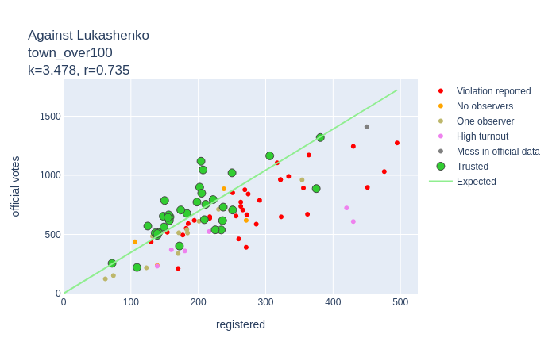
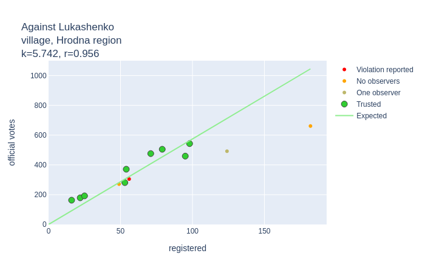
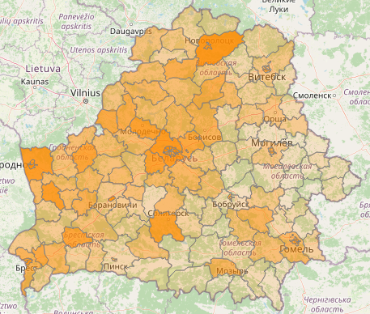

# Analyzing Voice2020 data.

Reference:
1. Source dara
 * 1.1. voice.csv
 * 1.2. geo-categorized.csv
 * 1.3. zubr.csv
2. Data preparation.
 * 2.1 Build common dataset
 * 2.2 Correlation
3. Clear data and calculate coefficients
 * 3.1 The plan
 * 3.2 Outliers on chart
 * 3.3 Fix number of corrupted ballots
 * 3.4 Alternative candidates coefficients
4. Turnout
5. Number of voters
6. Votes per candidate
7. Final results

## 1. Source data

There are 3 sourcs datasets to analyze

### geo-categorized.csv

Columns: 
* `id` - poll station unique identifier.
* `latitude`, `longitude` - poll station coordinates.
* `town` - town/city/village where poll station is situated.
* `area` - one of the following:
  * `village`
  * `town_below100` (towns with population less than 100.000 people)
  * `town_over100` (towns with population over 100.000: Babrujsk, Baranavičy, Barysaŭ, Lida, Mazyr, Navapolack, Orša, Pinsk, Salihorsk)
  * `city` (one of 5 region centers)
  * `capital` (Minsk)
  * `embassy` (poll stations abroad)
  * `minsk_suburb` (20 km around Minsk)
* `region`
  * 1 - Brest region
  * 2 - Viciebsk region
  * 3 - Homel region
  * 4 - Hrodna region
  * 5 - Minsk region
  * 6 - Mahiliou region
  * 7 - Minsk
  * 8 - Embassy
 
#### How was it built?

TBD

### voice.csv

Data from the Voice patform. Rows have the following key fields:
* `id` - poll station unique identifier
* `tihanovkaja_registered` - number of users who was going to vote for **tihanovkaja**
* `tihanovkaja_photoVoices` - number of ballots for **tihanovkaja** approved by photo
* `tihanovkaja_officialVotes` - number of ballots for **tihanovkaja** according to an official report
* and 18 more similar columns prefixed by:
  * `dmitriyev`
  * `kanopatskaja`
  * `lukashenko`
  * `cherechen` 
  * `against` (against evryone)
  * `corrupted` (ballot is corrupted by a voter)

#### How was it built?

TBD

### zubr.csv
Data from zubr.in 
* `id` - poll station unique identifier
* `zubr_id` - internal poll station number for the zubr.in site
* `observers` - number of observers for the poll station
* `accreditation-reject` - here and further `True` or `False` for a specific type of violation on this poll station
* `let-observer-in-violation`
* `no-let-observer-in`
* `observer-pushed-away`
* `force-beforehand-voting`
* `late-report`
* `home-voting-violation`
* `wrong-voters-number`
* `no-medcine-on-poll-station`
* `non-transparent-counting`
* `observer-limitations`
* `other`

#### How was it built?

Data was retrieved from `zubr.in` as 3 datasets:
 
* `zubr-violation-codes.csv`
 * `code` - integer code
 * `reason` - text explanation for this violation type
 
* `zubr-messages.json`
    Poll station as key, array of integer codes (see above) for violations on this poll station.

* `zubr-observers.csv`
 * `id`- poll station unique identifier
 * `zubr_id` - poll station identifier on `zubr.in`
 * `observers`- number of observers on the poll station. Integer >= 0

## 2. Data preparation

### 2.1 Build common dataset

#### First filtering

Take only those `voice.csv` rows where number of **registered** Voice users for **each candidate** is **more or equal** to the number of **official votes** for this candidate **or** there are **less than 10 registered** Voice users for this candidate.

Examples (*registered/official votes*):

| Tsikhanouskaya | Against | Dmitriyeu | Lukashenko | Can we take it? |
|:---:|:---:|:---:|:---:|:---|
|68 / 170|20 / 95|12 / 32|1 / 142| **Yes** |
|68 / 170|20 / 95|8 / 9|1 / 142| **Yes** |
|68 / 170|20 / 95|**8 / 7**|1 / 142| **Yes** `7 < 8`, but `8 < 10` |
|**68 / 39**|20 / 95|12 / 32|1 / 142| **No** `68 < 39` |
|68 / 170|20 / 95|**12 / 7**|1 / 142| **No** `7 < 12` and `12 > 10` |

Result is here: [tusted_by_voice.csv](tusted_by_voice.csv)

#### Join data

* Add `geo_categorized.csv` columns into voice.csv (join by `id`)
* Add `zubr.csv` columns into voice.csv (join by `id`)
* Replace following columns with a single `major-violations`:
  * `late-report`
  * `non-transparent-counting`
* Replace following columns with a single `minor-violations`:
  * `accreditation-reject` 
  * `let-observer-in-violation`
  * `no-let-observer-in`
  * `observer-pushed-away`
  * `force-beforehand-voting` 
  * `home-voting-violation`
  * `wrong-voters-number` 
  * `observer-limitations`
  * `other`

* Notice that `zubr.csv` has also introduced `wrong-voters-number`, `observers` and `zubr_id` columns. `no-medcine-on-poll-station` is ignored as not relevant to our aims.

Result is here: [tusted_by_voice.csv](tusted_by_voice_extended.csv). It also contains an `outlier-reason` column explained in the 3d chapter.
  
### 2.2 Correlation

There are **667** poll stations left. Let's draw some charts and calculate [Pearson correlation coefficient](https://en.wikipedia.org/wiki/Correlation_coefficient):

#### Votes for Tsikhanouskaya. X-axis - data according to *Voice*, Y-axis - official data:

|  |By registration|By photo|
|---|---|---|
|People voted for Tsikhanoukaja|||
|`Tsikhanouskaya votes` / `Total votes`|||
|`Tsikhanouskaya votes` / `Total voters`|||

As we see `registration` data tends to give more robust resluts than `photo` data. **Absolute** data is more reliable comparing to **relative** numbers.

Charts for **votes against Lukashenko** is built in a similar way. Votes against Lukashenko is a **sum of votes** for Tsikhanouskaya, Cherachen, Dmitriyeu, Kanapatskaya, against all candidates and corrupted ballots:

|By registration|By photo|
|---|---|
|||

## 3. Clear data and calculate coefficients

### 3.1 The plan
* Estimate real votes **against Lukashenko** as `y=kx` where 
  * `x` is a number of people registered in *Voice* on **each poll station** 
  * `k` is a linear coefficient to find with *least squares* method for different *areas* and *regions*. Notice that there is no intercept parameter `b` to make model as simple and understadable as possible.
* Estimate real **turnout** as an average for `area` and `region`. 
* Estimate poll station **size** (voters count) for those poll stations which are missing in *Zubr* reports. That is enough to estimate percent of Lukashenko voters.
* Estimate real votes for **Tsikhanouskaya** as `y=kx` where 
  * `x` is a number of people registered in *Voice* to vote for her on each poll station
  * `k` is a linear coefficient to find with *least squares* method for different *areas* and *regions*
* Estimate real votes for **other candidates**, **against** all candidates and **corrupted** ballots as a part of *neither Tsikhanouskaya nor Lukashenko* votes. `y = k(p_all - p_tsikhanouskaya)` where
  * `p_all` - estimated votes against Lukashenko
  * `p_tsikhanouskaya` - estimated votes for Tsikhanouskaya
  * `k` - *average* coefficient for each alternative candidate calculated for different *areas* and *regions*

### 3.2 Outliers on chart 
It was done iterativly: analyze and remove outliers, calculate coefficient for *area-region* pair, repeat. Below are charts with non-trusted poll stations marked. Only **288 polling stations** was left as trusted. Notice that some of them were not trusted when estimating turnout (see *chapter 5*).

| area/region | Brest | Viciebsk | Homieĺ | Hrodna | Minsk | Mahilioŭ | Total |
|:---:|---|---|---|---|---|---|---|
| Region centers except Minsk (*city*) |  |  |  |  |  |  |  |
| Towns with population over 100.000 (*town_over100*) |  |  |  |  |  |  |  |
| Towns with population less than 100.000 (*town_below100*) |  |  |  |  |  |  |  |
| Rural area (*village*) |  |  |  |  |  |  |  |
| Total |  |  |  |  |  |  |  |

How to read chart info. Examples:

`city, Viciebsk, source=area; k=3.662 (3.467) r=0.786 (0.933)` - linear coefficient for **Viciebsk** is *3.662* but coefficient ***3.467*** will be applied for votes estimation as total distribution for **all cities** has higher  **Pearson correlation coefficient**, *0.786 < 0.933*.

`town_over100, Viciebsk, source=total; k=2.659 (3.511) r=0.875 (0.895)` - linear coefficient for **big towns in Viciebsk region** (*Navapolack*, *Orša*) is *2.659* but coefficient ***3.511*** will be applied for votes estimation as total distribution for **all poll stations except Minsk city, Minsk suburb and embassies** has higher Pearson coefficient of corelation, *0.875 < 0.875*.

`town_below100, Viciebsk; k=5.154 r=0.972` - linear coefficient for **smaller towns in Viciebsk region** is ***5.154***. It'll be applied for votes estimation. Total distribution for all small towns, for Viciebsk area and total has coefficient of corelation lower than *0.972*.

`town_over100, Brest, source=region; k=? (3.784) r=? (0.955)` - there are **too few trusted polling stations** for **big towns in Brest region** (*Baranavičy*, *Pinsk*). Brest region coefficient ***3.784*** will be applied for this area-region pair as its coefficient of correlation (*0.955*) is higher than total big towns correlation (*0.839*) and total correlation (*0.895*).

Similar charts and calculations were done for Tsikhanouskaya votes. 

Outliers: [outliers.csv](outliers.csv)

Dataset after removing outliers: [trusted-for-alternative.csv](trusted-for-alternative.csv)

### 3.3 Fix number of corrupted ballots

Official number of corrupted ballots was published on another blank than the rest of polling station data. So, this number was often missed and not quite consistent across stations. It should be manually cleaned up.

[01-054-0001](http://partizan-results.com/pollingStations/01-054-0001) has votes **against** everyone, 196 not 381. 
 
[07-001-0089](http://partizan-results.com/pollingStations/07-001-0089) **total** official votes is 2220, not 2242.

For other cases (difference < 25) total number of votes is increased if it isn't enough to meet sum, number of corrupted ballots is increased if it's not enough to meet total number. 

Dataset after fixing number of corrupted ballots: [trusted-for-alternative-fixed.csv](trusted-for-alternative-fixed.csv)

Linear coefficients for protest votes: [protest_registered_coefficients.csv](protest_registered_coefficients.csv)

Linear coefficients for Tikhanouskaya votes: [tihanovkaja_registered_coefficients.csv](tihanovkaja_registered_coefficients.csv)

Columns:
* `area` - (see `geo_categorized.csv` above)
* `region` - (see `geo_categorized.csv` above)
* `coefficient` - calculated linear coefficient `k` previously described in `chapter 3`
* `correlation` - correlation for data from this `source` (see next column)
* `source` - what distribution this `coefficient` was calculated for:
  * `area-region` - this *area* in this *region*
  * `area` - all poll stations in this *area*
  * `region` - all poll stations in this *region* 
  * `total` - total distribution **except** Minsk, Minsk suburb and embassies.
  
Distribution (`source`) with the highest `correlation` was chosen for each `area`/`region` pair. See charts and examples above.

### 3.4 Alternative candidates coefficients

Alternative candidates in this context are all voting options except Lukashenko and Tikhanouskaya: Dmitriyeu, Cherachen, Kanapatskaya, against all candidates and corrupted ballots.

There is **not enough data** on Voice platform to predict votes for other candidates than Tikhanouskaya **per polling stattion**. Average part of each alternative candidate in **neither Lukashenko nor Tikhanouskaya votes** was calculated for each area-region pair. [Coefficient of variation](https://en.wikipedia.org/wiki/Coefficient_of_variation) was chosen as a measure of reliability. There were only 2 options to choose: either total (country-wise) distribution for the candidate or area-based distribution for the candidate. Average value for a distribution with a **lower coefficient of variation** was chosen for further calculation.

As far as votes **against** and **corrupted** ballots were often messed up together, **part of their sum** was initially calculated. Then **part of corrupted ballots in this pair** per each area. And then, as a result, part of **against** and **corrupted** separately.

We use different distributions for different areas and candidates, so it has to be **normalized** to have **1.0** as a sum of alternative candidates' fractions per each area.

Resulting dataset: [alt_candidates_coefficients.csv](alt_candidates_coefficients.csv)

Columns:
* `candidate` - one of:
  * `dmitriyev`
  * `kanopatskaja`
  * `cherechen` 
  * `against+corrupted` (1st step)
  * `corrupted/corrupted+against` (2nd step)
  * `against`  (3d step)
  * `corrupted` (3d step)
* `area`
* `coefficient` (float number between *0* and *1*)
* `std` (for intermediate calculations)
* `coeff_variation` (measure of reliability)
* `source` (one of `total` or `area`)

## 4. Turnout

*141* out of *288* polling stations were not trusted wnen calculating average turnout: [non_trusted_turnout.csv](non_trusted_turnout.csv)

Columns:
* `id` - polling station identifier
* `reason` - reason for not including into a trusted set. One of:
  * `zubr-report` - official number of voters differs from observed number
  * `no-observer` - there was no independent observers
  * `one-observer` - there was only one independent observer
  * `outlier` - official turnout is much higher than an average value for this area or region. Usually it comes together with much higher Lukashenko results than average in this region/area.

Estimated turnout dataset: [turnout.csv](turnout.csv)

Colunms:
* `area`
* `region`
* `turnout`
* `coeff_variation` - measure of reliability to choose the distribution (see below)
* `source` - subset of polling stations chosen for this area-region pair. One of `area-region` or `area`.

## 5. Number of voters

We don't have official data from **most of polling stations**. So, we don't know most of polling stations sizes - number of people assigned to this station. It was calculated as an average number per each *area* based on available *Voice* data: [poll-station-size.csv](poll-station-size.csv) 

Total number was of voters estimated this way was too high as we know **official number of voters** per each *region* (not *area*): [voters.csv](voters.csv). It was published before elections. Each *region* got its coefficient (`< 1`) to reduce expected polling station size.  

Resulting polling stations sizes: [total-votes.csv](total-votes.csv). This is a `voice.csv` dataset with a `voters` column added as an **expected number of voters** on this polling station - **official data for trusted** polling stations and trusted outliers, **estimated value for the rest** of polling stations.

## 6. Votes per candidate

Having number of **voters** and **turnout** we can get number of `votes`.

Having **votes**, number of users **registered** in *Voice* on each polling stations and **protest coefficient** we can get real number of votes for `Lukashenko`.

Having **votes**, number of users **registered** in *Voice* on each polling stations and **tihanovkaja coefficient** we can get real number of votes for `Tsikhanoukaya`.

Having number of users **registered** in *Voice* on each polling stations, **protest coefficient** and **alternative candidates coefficients** we can get real number of votes per each alternative candidate.

Final dataset: [total-candidates.csv](total-candidates.csv). This is a `voice.csv` dataset with `voters`, `turnout`, `votes`, `lukashenko`, `tihanovkaja`, `dmitriyev`, `kanopatskaja`, `cherechen`, `against`, `corrupted` columns added.

## 7. Final results

**Lukashenko: 45.2 %**

**Tsikhanouskaya: 42.6 %**

Against everyone: 6.0 %

Dmitriyeu: 1.9 %

Cherachen: 1.7 %

Kanapatskaya: 1.5 %

Corrupted ballots: 1.1 %

### On map (click for details):

| [Lukashenko vs Tsikhanovskaya](geo/compete.geojson) | [Lukashenko vs other options](geo/against-lukashenko.geojson) |
|---|---|
|||

| [Tsikhanovskaya voters](geo/tihanovkaja.geojson) | [Lukashenko voters](geo/lukashenko.geojson) | [Voters against everyone](geo/against.geojson) |
|---|---|---|
||||

