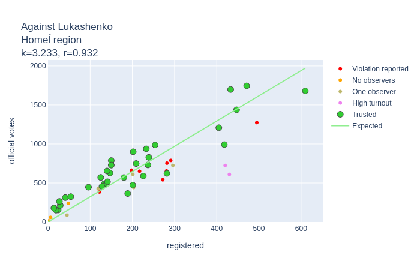

# Analyzing Voice2020 data.

Reference:
1. Source dara
 * 1.1. voice.csv
 * 1.2. geo-categorized.csv
 * 1.3. zubr.csv
2. Data preparation.
 * 2.1 Build common dataset
 * 2.2 Correlation
 * 2.3 Fix number of corrupted ballots
3. Clear data based on Zubr reports
4. Calculate coefficients
 * 4.1 For Tsikhanouskaya and against Lukashenko
 * 4.2 Alternative candidates coefficients
5. Turnout estimation
6. Caclulate total 
 * 6.1 Number of votes
 * 6.2 Votes per candidates
7. Results

## 1. Source data

There are 3 sourcs datasets to analyze

### geo-categorized.csv

Columns: 
* `id` - poll station unique identifier.
* `latitude`, `longitude` - poll station coordinates.
* `town` - town/city/village where poll station is situated.
* `area` - one of the following:
  * `village`
  * `town_below100` (towns with population less than 100.000 people)
  * `town_over100` (towns with population over 100.000: Babrujsk, Baranavičy, Barysaŭ, Lida, Mazyr, Navapolack, Orša, Pinsk, Salihorsk)
  * `city` (one of 5 region centers)
  * `capital` (Minsk)
  * `embassy` (poll stations abroad)
  * `minsk_suburb` (20 km around Minsk)
* `region`
  * 1 - Brest region
  * 2 - Viciebsk region
  * 3 - Homel region
  * 4 - Hrodna region
  * 5 - Minsk region
  * 6 - Mahiliou region
  * 7 - Minsk
  * 8 - Embassy
 
#### How was it built?

TBD

### voice.csv

Data from the Voice patform. Rows have the following key fields:
* `id` - poll station unique identifier
* `tihanovkaja_registered` - number of users who was going to vote for **tihanovkaja**
* `tihanovkaja_photoVoices` - number of ballots for **tihanovkaja** approved by photo
* `tihanovkaja_officialVotes` - number of ballots for **tihanovkaja** according to an official report
* and 18 more similar columns prefixed by:
  * `dmitriyev`
  * `kanopatskaja`
  * `lukashenko`
  * `cherechen` 
  * `against` (against evryone)
  * `corrupted` (ballot is corrupted by a voter)

#### How was it built?

TBD

### zubr.csv
Data from zubr.in 
* `id` - poll station unique identifier
* `zubr_id` - internal poll station number for the zubr.in site
* `observers` - number of observers for the poll station
* `accreditation-reject` - here and further `True` or `False` for a specific type of violation on this poll station
* `let-observer-in-violation`
* `no-let-observer-in`
* `observer-pushed-away`
* `force-beforehand-voting`
* `late-report`
* `home-voting-violation`
* `wrong-voters-number`
* `no-medcine-on-poll-station`
* `non-transparent-counting`
* `observer-limitations`
* `other`

#### How was it built?

Data was retrieved from `zubr.in` as 3 datasets:
 
* `zubr-violation-codes.csv`
 * `code` - integer code
 * `reason` - text explanation for this violation type
 
* `zubr-messages.json`
    Poll station as key, array of integer codes (see above) for violations on this poll station.

* `zubr-observers.csv`
 * `id`- poll station unique identifier
 * `zubr_id` - poll station identifier on `zubr.in`
 * `observers`- number of observers on the poll station. Integer >= 0

## 2. Data preparation

### 2.1 Build common dataset

#### First filtering

Take only those `voice.csv` rows where number of **registered** Voice users for **each candidate** is **more or equal** to the number of **official votes** for this candidate **or** there are **less than 10 registered** Voice users for this candidate.

Examples (*registered/official votes*):

| Tsikhanouskaya | Against | Dmitriyeu | Lukashenko | Can we take it? |
|:---:|:---:|:---:|:---:|:---|
|68 / 170|20 / 95|12 / 32|1 / 142| **Yes** |
|68 / 170|20 / 95|8 / 9|1 / 142| **Yes** |
|68 / 170|20 / 95|**8 / 7**|1 / 142| **Yes** `7 < 8`, but `8 < 10` |
|**68 / 39**|20 / 95|12 / 32|1 / 142| **No** `68 < 39` |
|68 / 170|20 / 95|**12 / 7**|1 / 142| **No** `7 < 12` and `12 > 10` |

Result is here: [tusted_by_voice.csv](tusted_by_voice.csv)

#### Join data

* Add `geo_categorized.csv` columns into voice.csv (join by `id`)
* Add `zubr.csv` columns into voice.csv (join by `id`)
* Replace following columns with a single `major-violations`:
  * `late-report`
  * `non-transparent-counting`
* Replace following columns with a single `minor-violations`:
  * `accreditation-reject` 
  * `let-observer-in-violation`
  * `no-let-observer-in`
  * `observer-pushed-away`
  * `force-beforehand-voting` 
  * `home-voting-violation`
  * `wrong-voters-number` 
  * `observer-limitations`
  * `other`

* Notice that `zubr.csv` has also introduced `wrong-voters-number`, `observers` and `zubr_id` columns. `no-medcine-on-poll-station` is ignored as not relevant to our aims.

Result is here: [tusted_by_voice.csv](tusted_by_voice_extended.csv). It also contains an `outlier-reason` column explained in the 3d chapter.
  
### 2.2 Correlation

There are **667** poll stations left. Let's draw some charts and calculate [correlation coefficient](https://en.wikipedia.org/wiki/Correlation_coefficient):

#### Votes for Tsikhanouskaya. X-axis - data according to *Voice*, Y-axis - official data:

|  |By registration|By photo|
|---|---|---|
|People voted for Tsikhanoukaja|||
|`Tsikhanouskaya votes` / `Total votes`|||
|`Tsikhanouskaya votes` / `Total voters`|||

As we see `registration` data tends to give more robust resluts than `photo` data. **Absolute** data is more reliable comparing to **relative** numbers.

#### Votes against Lukashenko:

|By registration|By photo|
|---|---|
|||

## 3. Clear data and calculate coefficients

### 3.1 The plan
* Estimate real votes **against Lukashenko** as `y=kx` where 
  * `x` is a number of people registered in *Voice* on **each poll station** 
  * `k` is a linear coefficient to find with *least squares* method for different *areas* and *regions*. Notice that there is no intercept parameter `b` to make model as simple and understadable as possible.
* Estimate real **turnout** as an average for `area` and `region`. 
* Estimate poll station **size** (voters count) for those poll stations which are missing in *Zubr* reports. That is enough to estimate percent of Lukashenko voters.
* Estimate real votes for **Tsikhanouskaya** as `y=kx` where 
  * `x` is a number of people registered in *Voice* to vote for her on each poll station
  * `k` is a linear coefficient to find with *least squares* method for different *areas* and *regions*
* Estimate real votes for **other candidates**, **against** all candidates and **corrupted** ballots as a part of *neither Tsikhanouskaya nor Lukashenko* votes. `y = k(p_all - p_tsikhanouskaya)` where
  * `p_all` - estimated votes against Lukashenko
  * `p_tsikhanouskaya` - estimated votes for Tsikhanouskaya
  * `k` - *average* coefficient for each alternative candidate calculated for different *areas* and *regions*

### 3.2 Outliers on chart 
It was done iterativly: analyze and remove outliers, calculate coefficient for *area-region* pair, repeat. Below are charts with non-trusted poll stations marked. Only **288 poll stations** was left as trusted. Notice that some of them were not trusted when estimating turnout (see below).

| area/region | Brest | Viciebsk | Homeĺ | Hrodna | Minsk | Mahilioŭ | Total |
|:---:|---|---|---|---|---|---|---|
| Region centers except Minsk (*city*) |  |  |  |  |  |  |  |
| Towns with population over 100.000 (*town_over100*) |  |  |  |  |  |  |  |
| Towns with population less than 100.000 (*town_below100*) |  |  |  |  |  |  |  |
| Rural area (*village*) |  |  |  |  |  |  |  |
| Total |  |  |  |  |  |  |  |

How to read chart info. Examples:

`city, Viciebsk, source=area; k=3.662 (3.467) r=0.786 (0.933)` - linear coefficient for **Viciebsk** is *3.662* but coefficient ***3.467*** will be applied for votes estimation as total distribution for **all cities** has higher  **Pearson coefficient of corelation**, *0.786 < 0.933*.

`town_over100, Viciebsk, source=total; k=2.659 (3.511) r=0.875 (0.895)` - linear coefficient for **big towns in Viciebsk region** (*Navapolack*, *Orša*) is *2.659* but coefficient ***3.511*** will be applied for votes estimation as total distribution for **all poll stations except Minsk city, Minsk suburb and embassies** has higher Pearson coefficient of corelation, *0.875 < 0.875*.

`town_below100, Viciebsk; k=5.154 r=0.972` - linear coefficient for **smaller towns in Viciebsk region** is ***5.154***. It'll be applied for votes estimation. Total distribution for all small towns, for Viciebsk area and total has coefficient of corelation lower than *0.972*.

`town_over100, Brest, source=region; k=? (3.784) r=? (0.955)` - there are **too few trusted polling stations** for **big towns in Brest region** (*Baranavičy*, *Pinsk*). Brest region coefficient ***3.784*** will be applied for this area-region pair as its coefficient of correlation (*0.955*) is higher than total big towns correlation (*0.839*) and total correlation (*0.895*).

Outliers: [outliers.csv](outliers.csv)

Dataset after removing outliers: [trusted-for-alternative.csv](trusted-for-alternative.csv)

### 3.3 Fix number of corrupted ballots

Number of corrupted ballots is filled on another blank than the rest of official data. So, this data was often missed and not quite consistent across poll stations. It should be manually cleaned up.

TBD

Resulting dataset: [trusted-for-alternative-fixed.csv](trusted-for-alternative-fixed.csv)

  
Here are resulting datasets: [protest_registered_coefficients.csv](protest_registered_coefficients.csv), [tihanovkaja_registered_coefficients.csv](tihanovkaja_registered_coefficients.csv)

Columns:
* `area` - (see `geo_categorized.csv` above)
* `region` - (see `geo_categorized.csv` above)
* `coefficient` - calculated linear coefficient `k` previously described in `chapter 3`
* `correlation` - correlation for data from this `source` (see next column)
* `source` - what distribution this `coefficient` was calculated for:
  * `area-region` - this *area* in this *region*
  * `area` - all poll stations in this *area*
  * `region` - all poll stations in this *region* 
  * `total` - total distribution **except** Minsk, Minsk suburb and embassies.
  
Distribution (`source`) with the highest `correlation` was chosen for each `area`/`region` pair. 

TBD: tables and charts 

 

### 4.2 Alternative candidates coefficients
TBD

## 5. Turnout estimation
TBD

## 6. Caclulate total
### 6.1 Number of votes
TBD
### 6.2 Votes per candidates
TBD

## 7. Estimated final results.

### Total:

**lukashenko: 45.2 %**

**tihanovkaja: 42.6 %**

against: 6.1 %

dmitriyev: 1.9 %

cherechen: 1.7 %

kanopatskaja: 1.5 %

corrupted: 1.1 %

### On map (click for details):

| [Lukashenko vs Tsikhanovskaya](geo/compete.geojson) | [Lukashenko vs other options](geo/against-lukashenko.geojson) |
|---|---|
|||

Further information is outdated:

### By region

#### Brest region

**lukashenko: 47.9 %**

**tihanovkaja: 39.3 %**

against: 6.2 %

dmitriyev: 2.1 %

cherechen: 1.9 %

kanopatskaja: 1.5 %

corrupted: 1.2 %

#### Viciebsk region

**lukashenko: 63.8 %**

**tihanovkaja: 26.8 %**

against: 4.5 %

dmitriyev: 1.5 %

cherechen: 1.4 %

kanopatskaja: 1.1 %

corrupted: 0.8 %

#### Homel region

**lukashenko: 61.5 %**

**tihanovkaja: 29.6 %**

against: 4.3 %

dmitriyev: 1.4 %

cherechen: 1.3 %

kanopatskaja: 1.1 %

corrupted: 0.8 %

#### Hrodna region

**lukashenko: 43.2 %**

**tihanovkaja: 43.8 %**

against: 6.3 %

dmitriyev: 2.1 %

cherechen: 1.9 %

kanopatskaja: 1.5 %

corrupted: 1.1 %

#### Minsk region (without Minsk)

**lukashenko: 51.8 %**

**tihanovkaja: 37.7 %**

against: 5.2 %

dmitriyev: 1.7 %

cherechen: 1.4 %

kanopatskaja: 1.2 %

corrupted: 1.0 %

#### Mahiliou region

**lukashenko: 66.5 %**

**tihanovkaja: 25.2 %**

against: 4.0 %

dmitriyev: 1.3 %

cherechen: 1.2 %

kanopatskaja: 0.9 %

corrupted: 0.7 %

#### Minsk

**lukashenko: 20.7 %**

**tihanovkaja: 62.2 %**

against: 8.9 %

dmitriyev: 2.1 %

cherechen: 2.0 %

kanopatskaja: 2.0 %

corrupted: 2.1 %

#### Embassy

**lukashenko: 49.9 %**

**tihanovkaja: 47.7 %**

against: 0.7 %

dmitriyev: 0.4 %

cherechen: 0.3 %

kanopatskaja: 0.4 %

corrupted: 0.6 %

### By area

#### capital

**lukashenko: 20.5 %**

**tihanovkaja: 62.3 %**

against: 9.0 %

dmitriyev: 2.1 %

cherechen: 2.0 %

kanopatskaja: 2.0 %

corrupted: 2.1 %

#### minsk_suburb

**lukashenko: 34.6 %**

**tihanovkaja: 56.4 %**

against: 4.4 %

dmitriyev: 1.5 %

cherechen: 1.2 %

kanopatskaja: 1.1 %

corrupted: 0.9 %

#### city

**lukashenko: 41.1 %**

**tihanovkaja: 44.0 %**

against: 7.3 %

dmitriyev: 2.5 %

cherechen: 2.2 %

kanopatskaja: 1.8 %

corrupted: 1.2 %

#### town_over100

**lukashenko: 44.6 %**

**tihanovkaja: 42.5 %**

against: 6.3 %

dmitriyev: 2.0 %

cherechen: 1.9 %

kanopatskaja: 1.3 %

corrupted: 1.3 %

#### town_below100

**lukashenko: 50.6 %**

**tihanovkaja: 37.7 %**

against: 5.9 %

dmitriyev: 1.9 %

cherechen: 1.7 %

kanopatskaja: 1.3 %

corrupted: 1.0 %

#### village

**lukashenko: 75.5 %**

**tihanovkaja: 19.0 %**

against: 2.5 %

dmitriyev: 0.9 %

cherechen: 0.7 %

kanopatskaja: 0.8 %

corrupted: 0.6 %

### Major cities

#### Brest 

**lukashenko: 30.1 %**

**tihanovkaja: 49.8 %**

against: 9.8 %

dmitriyev: 3.3 %

cherechen: 3.0 %

kanopatskaja: 2.4 %

corrupted: 1.6 %

#### Viciebsk

**lukashenko: 51.2 %**

**tihanovkaja: 36.2 %**

against: 6.1 %

dmitriyev: 2.1 %

cherechen: 1.9 %

kanopatskaja: 1.5 %

corrupted: 1.0 %

#### Homel

**lukashenko: 41.9 %**

**tihanovkaja: 44.9 %**

against: 6.4 %

dmitriyev: 2.2 %

cherechen: 2.0 %

kanopatskaja: 1.6 %

corrupted: 1.0 %

#### Hrodna

**lukashenko: 31.1 %**

**tihanovkaja: 52.5 %**

against: 7.9 %

dmitriyev: 2.7 %

cherechen: 2.5 %

kanopatskaja: 2.0 %

corrupted: 1.3 %

#### Mahiliou

**lukashenko: 50.5 %**

**tihanovkaja: 36.6 %**

against: 6.3 %

dmitriyev: 2.1 %

cherechen: 1.9 %

kanopatskaja: 1.5 %

corrupted: 1.0 %

#### Lida

**lukashenko: 37.5 %**

**tihanovkaja: 48.0 %**

against: 7.0 %

dmitriyev: 2.3 %

cherechen: 2.1 %

kanopatskaja: 1.4 %

corrupted: 1.6 %

#### Baranavičy

**lukashenko: 32.2 %**

**tihanovkaja: 53.2 %**

against: 7.1 %

dmitriyev: 2.3 %

cherechen: 2.2 %

kanopatskaja: 1.5 %

corrupted: 1.5 %

#### Pinsk

**lukashenko: 50.6 %**

**tihanovkaja: 38.5 %**

against: 5.4 %

dmitriyev: 1.7 %

cherechen: 1.6 %

kanopatskaja: 1.1 %

corrupted: 1.1 %

#### Mazyr

**lukashenko: 48.4 %**

**tihanovkaja: 39.9 %**

against: 5.7 %

dmitriyev: 1.9 %

cherechen: 1.8 %

kanopatskaja: 1.2 %

corrupted: 1.2 %

#### Babrujsk

**lukashenko: 50.1 %**

**tihanovkaja: 38.7 %**

against: 5.5 %

dmitriyev: 1.7 %

cherechen: 1.7 %

kanopatskaja: 1.1 %

corrupted: 1.2 %

