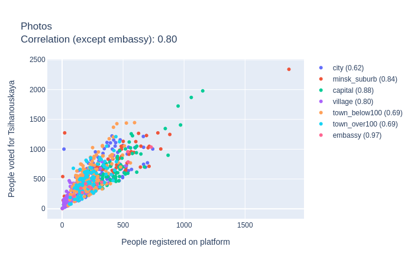
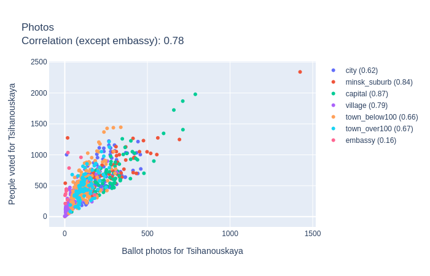
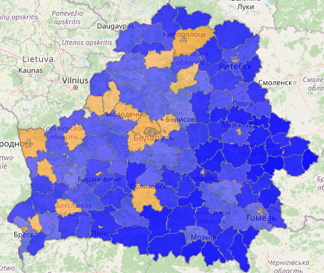

# Analyzing Voice2020 data.

Reference:
1. Source dara
 * 1.1. voice.csv
 * 1.2. geo-categorized.csv
 * 1.3. zubr.csv
2. Data preparation.
 * 2.1 Registered count vs Photos count
 * 2.2 Fix number of corrupted ballots
3. Calculate coefficients
 * 3.1 Tsikhanouskaya coefficients
 * 3.2 Protest coefficients
 * 3.3 Alternative candidates coefficients
4. Clear data based on Zubr reports
5. Turnout estimation
6. Caclulate total 
 * 6.1 Number of votes
 * 6.2 Votes per candidates
7. Results

## 1. Source data

There are 3 sourcs datasets to analyze

### geo-categorized.csv

Columns: 
* `id` - poll station unique identifier.
* `latitude`, `longitude` - poll station coordinates.
* `town` - town/city/village where poll station is situated.
* `area` - one of the following:
  * `village`
  * `town_below100` (towns with population less than 100.000 people)
  * `town_over100` (one of 9 towns with population over 100.000)
  * `city` (one of 5 region centers)
  * `capital` (Minsk)
  * `embassy` (poll stations abroad)
  * `minsk_suburb` (20 km around Minsk)
* `region`
  * 1 - Brest region
  * 2 - Viciebsk region
  * 3 - Homel region
  * 4 - Hrodna region
  * 5 - Minsk region
  * 6 - Mahiliou region
  * 7 - Minsk
  * 8 - Embassy
 
#### How was it built?

TBD

### voice.csv

Data from the Voice patform. Rows have the following key fields:
* `id` - poll station unique identifier
* `tihanovkaja_registered` - number of users who was going to vote for **tihanovkaja**
* `tihanovkaja_photoVoices` - number of ballots for **tihanovkaja** approved by photo
* `tihanovkaja_officialVotes` - number of ballots for **tihanovkaja** according to an official report
* and 18 more similar columns prefixed by:
  * `dmitriyev`
  * `kanopatskaja`
  * `lukashenko`
  * `cherechen` 
  * `against` (against evryone)
  * `corrupted` (ballot is corrupted by a voter)

#### How was it built?

TBD

### zubr.csv
Data from zubr.in 
* `id` - poll station unique identifier
* `zubr_id` - internal poll station number for the zubr.in site
* `observers` - number of observers for the poll station
* `accreditation-reject` - here and further `True` or `False` for a specific type of violation on this poll station
* `let-observer-in-violation`
* `no-let-observer-in`
* `observer-pushed-away`
* `force-beforehand-voting`
* `late-report`
* `home-voting-violation`
* `wrong-voters-number`
* `no-medcine-on-poll-station`
* `non-transparent-counting`
* `observer-limitations`
* `other`

#### How was it built?

 TBD
 
zubr-messages.csv
zubr-violation-codes.csv
zubr-observers.csv

## 2. Data preparation

* Add geo_categorized.csv columns into voice.csv (join by `id`)
* Take only those voice.csv rows where 
  * Number of **registered** voices for each candidate is **more or equal** to the number of **official votes** for this candidate...
  * ... or there are **less than 10 registered** voices for a candidate
* There are **668** poll stations left. Draw charts:

|||
|---|---|
|||

## 3-6 TBD

## Estimated final results.

### Total:

**lukashenko: 50.0 %**

**tihanovkaja: 38.5 %**

against: 5.7 %

dmitriyev: 1.8 %

cherechen: 1.6 %

kanopatskaja: 1.4 %

corrupted: 1.1 %

### On map:

| Lukashenko vs Tsikhanovskaya | Lukashenko vs other options |
|---|---|
|||
| [Interactive map](geo/compete.geojson) | [Interactive map](geo/against-lukashenko.geojson) |

### By region:
####Brest region:

**lukashenko: 47.9 %**

**tihanovkaja: 39.3 %**

against: 6.2 %

dmitriyev: 2.1 %

cherechen: 1.9 %

kanopatskaja: 1.5 %

corrupted: 1.2 %

####Viciebsk region

**lukashenko: 63.8 %**

**tihanovkaja: 26.8 %**

against: 4.5 %

dmitriyev: 1.5 %

cherechen: 1.4 %

kanopatskaja: 1.1 %

corrupted: 0.8 %

####Homel region

**lukashenko: 61.5 %

**tihanovkaja: 29.6 %

**against: 4.3 %

**dmitriyev: 1.4 %

**cherechen: 1.3 %

**kanopatskaja: 1.1 %

**corrupted: 0.8 %

####Hrodna region

**lukashenko: 43.2 %

**tihanovkaja: 43.8 %

against: 6.3 %

dmitriyev: 2.1 %

cherechen: 1.9 %

kanopatskaja: 1.5 %

corrupted: 1.1 %

#### Minsk region (without Minsk)

**lukashenko: 51.8 %

**tihanovkaja: 37.7 %

against: 5.2 %

dmitriyev: 1.7 %

cherechen: 1.4 %

kanopatskaja: 1.2 %

corrupted: 1.0 %

#### Mahiliou

**lukashenko: 66.5 %

**tihanovkaja: 25.2 %

against: 4.0 %

dmitriyev: 1.3 %

cherechen: 1.2 %

kanopatskaja: 0.9 %

corrupted: 0.7 %

#### Minsk

**lukashenko: 20.7 %

**tihanovkaja: 62.2 %

against: 8.9 %

dmitriyev: 2.1 %

cherechen: 2.0 %

kanopatskaja: 2.0 %

corrupted: 2.1 %

#### Embassy

**lukashenko: 49.9 %

**tihanovkaja: 47.7 %

against: 0.7 %

dmitriyev: 0.4 %

cherechen: 0.3 %

kanopatskaja: 0.4 %

corrupted: 0.6 %

### By area

city

lukashenko: 41.1 %
tihanovkaja: 44.0 %
against: 7.3 %
dmitriyev: 2.5 %
cherechen: 2.2 %
kanopatskaja: 1.8 %
corrupted: 1.2 %

minsk_suburb

lukashenko: 34.6 %
tihanovkaja: 56.4 %
against: 4.4 %
dmitriyev: 1.5 %
cherechen: 1.2 %
kanopatskaja: 1.1 %
corrupted: 0.9 %

capital

lukashenko: 20.5 %
tihanovkaja: 62.3 %
against: 9.0 %
dmitriyev: 2.1 %
cherechen: 2.0 %
kanopatskaja: 2.0 %
corrupted: 2.1 %

village

lukashenko: 75.5 %
tihanovkaja: 19.0 %
against: 2.5 %
dmitriyev: 0.9 %
cherechen: 0.7 %
kanopatskaja: 0.8 %
corrupted: 0.6 %

town_below100

lukashenko: 50.6 %
tihanovkaja: 37.7 %
against: 5.9 %
dmitriyev: 1.9 %
cherechen: 1.7 %
kanopatskaja: 1.3 %
corrupted: 1.0 %

town_over100

lukashenko: 44.6 %
tihanovkaja: 42.5 %
against: 6.3 %
dmitriyev: 2.0 %
cherechen: 1.9 %
kanopatskaja: 1.3 %
corrupted: 1.3 %

### Major cities

Brest 

lukashenko: 30.1 %
tihanovkaja: 49.8 %
against: 9.8 %
dmitriyev: 3.3 %
cherechen: 3.0 %
kanopatskaja: 2.4 %
corrupted: 1.6 %

Viciebsk

lukashenko: 51.2 %
tihanovkaja: 36.2 %
against: 6.1 %
dmitriyev: 2.1 %
cherechen: 1.9 %
kanopatskaja: 1.5 %
corrupted: 1.0 %

Homel

lukashenko: 41.9 %
tihanovkaja: 44.9 %
against: 6.4 %
dmitriyev: 2.2 %
cherechen: 2.0 %
kanopatskaja: 1.6 %
corrupted: 1.0 %

Hrodna

lukashenko: 31.1 %
tihanovkaja: 52.5 %
against: 7.9 %
dmitriyev: 2.7 %
cherechen: 2.5 %
kanopatskaja: 2.0 %lukashenko: 50.5 %
tihanovkaja: 36.6 %
against: 6.3 %
dmitriyev: 2.1 %
cherechen: 1.9 %
kanopatskaja: 1.5 %
corrupted: 1.0 %
corrupted: 1.3 %

Mahiliou

lukashenko: 50.5 %
tihanovkaja: 36.6 %
against: 6.3 %
dmitriyev: 2.1 %
cherechen: 1.9 %
kanopatskaja: 1.5 %
corrupted: 1.0 %

Lida

lukashenko: 37.5 %
tihanovkaja: 48.0 %
against: 7.0 %
dmitriyev: 2.3 %
cherechen: 2.1 %
kanopatskaja: 1.4 %
corrupted: 1.6 %

Baranavičy, Pinsk

lukashenko: 40.3 %
tihanovkaja: 46.7 %
against: 6.3 %
dmitriyev: 2.0 %
cherechen: 1.9 %
kanopatskaja: 1.3 %
corrupted: 1.3 %

Mazyr

lukashenko: 48.4 %
tihanovkaja: 39.9 %
against: 5.7 %
dmitriyev: 1.9 %
cherechen: 1.8 %
kanopatskaja: 1.2 %
corrupted: 1.2 %

Babrujsk

lukashenko: 50.1 %
tihanovkaja: 38.7 %
against: 5.5 %
dmitriyev: 1.7 %
cherechen: 1.7 %
kanopatskaja: 1.1 %
corrupted: 1.2 %

